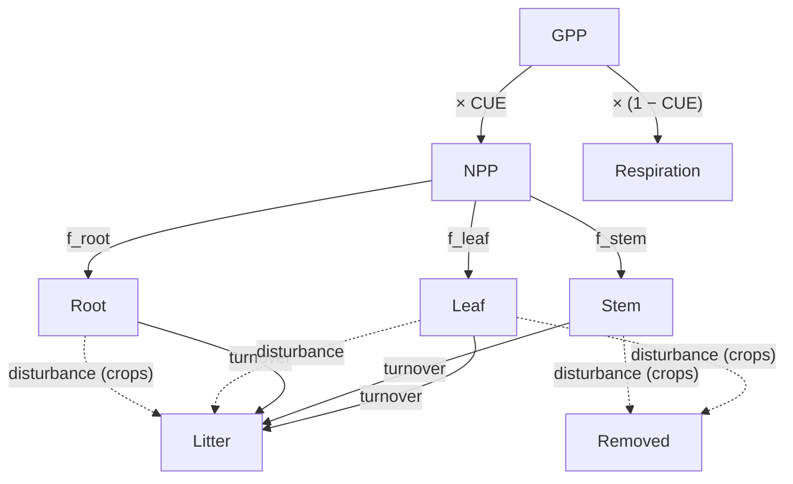

# Scientific Background

SGAM (Simplified Growth and Allocation Model) simulates the allocation of photosynthetically-fixed carbon to plant tissue across four plant functional types (PFTs): trees, grasses, shrubs, and crops.
The model operates at weekly timesteps using a forward Euler integration scheme, tracking carbon in five pools: leaf, stem, root, litter, and a removed-by-disturbance pool (see [`SgamPools`](API_Reference/sgam.md#sgam.sgam.SgamPools)).

The central question the model addresses is: given a prescribed Gross Primary Productivity (GPP), how does a plant distribute that carbon among competing sinks under varying temperature, soil moisture, and atmospheric demand? The [`Sgam`](API_Reference/sgam.md#sgam.sgam.Sgam) class implements the full weekly integration loop and returns a [`SgamOutput`](API_Reference/sgam.md#sgam.sgam.SgamOutput) containing all pools, fluxes, and diagnostics.

## Carbon Use Efficiency

The fraction of GPP retained as biomass — the Carbon Use Efficiency (CUE) — depends on two physiological efficiency metrics that serve as proxies for photosynthetic resource limitation:

- **LUE** (Light Use Efficiency, gC MJ⁻¹): carbon fixed per unit of absorbed photosynthetically active radiation
- **iWUE** (Intrinsic Water Use Efficiency, μmol mol⁻¹): ratio of net photosynthesis to stomatal conductance

Each is normalised against a PFT-specific maximum ([`PftParams.lue_max`](API_Reference/pft.md#sgam.pft.PftParams), [`PftParams.iwue_max`](API_Reference/pft.md#sgam.pft.PftParams)) to produce a dimensionless score in $[0, 1]$:

$$s_{\text{LUE}} = \min\!\left(\frac{\text{LUE}}{\text{LUE}_{\max}}, 1\right), \qquad s_{\text{iWUE}} = \min\!\left(\frac{\text{iWUE}}{\text{iWUE}_{\max}}, 1\right)$$

The mean score then linearly scales CUE between a biological minimum and maximum:

$$\text{CUE} = \text{CUE}_{\min} + \bar{s} \cdot (\text{CUE}_{\max} - \text{CUE}_{\min}), \quad \bar{s} = \tfrac{1}{2}(s_{\text{LUE}} + s_{\text{iWUE}})$$

with $\text{CUE}_{\min} = 0.2$ and $\text{CUE}_{\max} = 0.7$. 

Net Primary Productivity is then

$$\text{NPP} = \text{GPP} \times \text{CUE}$$

and the remainder $\text{GPP} \times (1 - \text{CUE})$ is autotrophic respiration (see [`SgamRespiration`](API_Reference/sgam.md#sgam.sgam.SgamRespiration)). The normalised scores and CUE value are recorded in [`SgamDiagnostics`](API_Reference/sgam.md#sgam.sgam.SgamDiagnostics).

## Drought Modifier

Water availability constrains carbon allocation independently via a drought modifier $f_{\text{drought}} \in [0, 1]$.

**Soil moisture stress** scales linearly between the wilting point $\theta_{\text{wp}}$ and field capacity $\theta_{\text{fc}}$ (PFT-specific parameters [`wilting_point`](API_Reference/pft.md#sgam.pft.PftParams) and [`field_capacity`](API_Reference/pft.md#sgam.pft.PftParams), units m³ m⁻³):

$$f_{\text{sm}} = \text{clip}\!\left(\frac{\theta - \theta_{\text{wp}}}{\theta_{\text{fc}} - \theta_{\text{wp}}},\; 0,\; 1\right)$$

**VPD stress** declines exponentially above a PFT-specific threshold $\text{VPD}_{\text{thr}}$, reflecting stomatal closure under atmospheric drying:

$$f_{\text{vpd}} = \exp\!\left(-\gamma \cdot \max(0,\; \text{VPD} - \text{VPD}_{\text{thr}})\right)$$

where $\gamma$ (Pa⁻¹) is a PFT-specific sensitivity coefficient ([`vpd_sensitivity`](API_Reference/pft.md#sgam.pft.PftParams)) and $\text{VPD}_{\text{thr}}$ is [`vpd_threshold`](API_Reference/pft.md#sgam.pft.PftParams).

The combined drought modifier applies Liebig's Law of the Minimum.
Productivity is limited by whichever resource is most constraining:

$$f_{\text{drought}} = \min(f_{\text{sm}},\; f_{\text{vpd}})$$

## Dynamic Allocation

NPP is split among leaf, stem, and root pools by allocation fractions $(f_{\text{leaf}}, f_{\text{stem}}, f_{\text{root}})$ that sum to 1, recorded in [`SgamDiagnostics`](API_Reference/sgam.md#sgam.sgam.SgamDiagnostics) and the per-pool growth in [`SgamNPP`](API_Reference/sgam.md#sgam.sgam.SgamNPP). Each fraction is adjusted dynamically from PFT-specific base values ([`leaf_base_allocation`](API_Reference/pft.md#sgam.pft.PftParams), [`stem_base_allocation`](API_Reference/pft.md#sgam.pft.PftParams), [`root_base_allocation`](API_Reference/pft.md#sgam.pft.PftParams)) by three modifiers.

**Seasonality** drives a sinusoidal preference for leaves in the growing season:

$$m_{\text{season}} = 0.15 \cdot \sin\!\left(\frac{2\pi(\text{week} - 12)}{52}\right)$$

This peaks at week 26 (northern hemisphere summer solstice) and troughs in winter, with a phase shift of 12 weeks so that allocation to leaves begins ramping up in spring.

**Temperature deviation** from an optimum ([`temp_optimum`](API_Reference/pft.md#sgam.pft.PftParams), [`temp_sensitivity`](API_Reference/pft.md#sgam.pft.PftParams)) shifts allocation toward roots when temperatures are below-optimal ($T < T_{\text{opt}}$) and toward leaves when above-optimal ($T > T_{\text{opt}}$):

$$m_{\text{temp}} = \text{clip}\!\left(\frac{T - T_{\text{opt}}}{T_{\text{range}}},\; -0.1,\; 0.1\right)$$

**Drought root bonus** increases root allocation under water or atmospheric stress, following the functional balance hypothesis that plants invest in roots when below-ground resources are limiting:

$$b_{\text{root}} = 0.15 \cdot \max(s_{\text{moisture}},\; s_{\text{vpd}})$$

where the stress scores are

$$s_{\text{moisture}} = \text{clip}\!\left(1 - \frac{\theta}{\theta_{\text{mid}}},\; 0,\; 1\right), \quad \theta_{\text{mid}} = \tfrac{1}{2}(\theta_{\text{wp}} + \theta_{\text{fc}})$$

$$s_{\text{vpd}} = \text{clip}\!\left(\frac{\text{VPD}}{\text{VPD}_{\text{thr}}},\; 0,\; 1\right)$$

The raw adjusted allocations are

$$a_{\text{leaf}} = \max\!\left(0.05,\; a_{\text{leaf}}^{(0)} + m_{\text{season}} + m_{\text{temp}} - \tfrac{b_{\text{root}}}{2}\right)$$

$$a_{\text{stem}} = \max\!\left(0.01,\; a_{\text{stem}}^{(0)} - \tfrac{b_{\text{root}}}{2}\right)$$

$$a_{\text{root}} = \max\!\left(0.05,\; a_{\text{root}}^{(0)} - m_{\text{season}} - m_{\text{temp}} + b_{\text{root}}\right)$$

where the floors prevent biologically unrealistic allocation. The fractions used for partitioning are then normalised so that $f_{\text{leaf}} + f_{\text{stem}} + f_{\text{root}} = 1$.

## Turnover and Litter

Each pool loses biomass at a fixed first-order rate each week:

$$\Delta P_{\text{pool}}^{\text{turn}} = k_{\text{pool}} \cdot P_{\text{pool}}$$

where $k_{\text{pool}}$ (week⁻¹) is the PFT-specific turnover rate ([`leaf_turnover_rate`](API_Reference/pft.md#sgam.pft.PftParams), [`stem_turnover_rate`](API_Reference/pft.md#sgam.pft.PftParams), [`root_turnover_rate`](API_Reference/pft.md#sgam.pft.PftParams)).
Losses from all three pools accumulate in the litter pool; weekly turnover fluxes are stored in [`SgamTurnover`](API_Reference/sgam.md#sgam.sgam.SgamTurnover). The corresponding mean residence times $1/k$ span a wide range — from roughly 20 weeks for crop leaves to ~5000 weeks for tree wood — reflecting the spectrum from fast-cycling herbaceous tissues to slow-decomposing structural carbon.

## Disturbances

A [`Disturbances`](API_Reference/disturbance.md#sgam.disturbance.Disturbances) object can flag disturbance events from daily time series by checking three simultaneous conditions: the growing season is active (temperature above a threshold), GPP has declined by more than a threshold fraction, and LAI has declined by more than that same fraction.
The severity is the larger of the two relative declines, clipped to $[0, 1]$. Daily severities can be aggregated to weekly resolution with [`aggregate_to_weekly`](API_Reference/disturbance.md#sgam.disturbance.aggregate_to_weekly) before passing to [`Sgam`](API_Reference/sgam.md#sgam.sgam.Sgam).

The response to disturbance differs by PFT:

- **Crops**: any event above [`disturbance_threshold`](API_Reference/pft.md#sgam.pft.PftParams) triggers complete removal of all above-ground biomass (leaf + stem pools); root carbon transfers to litter, representing harvest.
- **All other PFTs**: a fraction of the leaf pool proportional to severity (up to [`disturbance_leaf_loss_frac`](API_Reference/pft.md#sgam.pft.PftParams)) is transferred to litter, representing partial defoliation by fire, grazing, or pest damage.

Disturbance fluxes at each timestep are recorded in [`SgamDisturbance`](API_Reference/sgam.md#sgam.sgam.SgamDisturbance).

## Plant Functional Type Parameters

The model includes four [`PlantFunctionalType`](API_Reference/pft.md#sgam.pft.PlantFunctionalType) values whose [`PftParams`](API_Reference/pft.md#sgam.pft.PftParams) encode distinct ecological strategies. Default parameter sets can be retrieved with [`get_default_pft_params`](API_Reference/pft.md#sgam.pft.get_default_pft_params).

--8<-- "_static/pft_table.txt"

Trees invest heavily in long-lived structural carbon (45% stem base allocation; stem residence time ~96 years), while grasses prioritise rapid leaf and root turnover.
Shrubs are characterised by high water-use efficiency and drought tolerance (iWUE_max 650 μmol mol⁻¹; VPD threshold 1200 Pa; lowest wilting point).
Crops are optimised for above-ground productivity with the highest LUE_max and lowest water-use efficiency, reflecting high-input agricultural conditions.

## Mass Balance

At each timestep [`Sgam`](API_Reference/sgam.md#sgam.sgam.Sgam) checks that carbon is conserved across all three live pools:

$$P_{\text{pool}}(t) = P_{\text{pool}}(t-1) + \text{NPP}_{\text{pool}}(t) - \Delta P_{\text{pool}}^{\text{turn}}(t) - \Delta P_{\text{pool}}^{\text{dist}}(t)$$

Any violation beyond a relative tolerance of $10^{-6}$ indicates a numerical error. 
The litter and removed pools similarly accumulate all outgoing fluxes from the live pools, so total system carbon equals the integral of GPP minus cumulative autotrophic respiration minus cumulative disturbance removal.

## References

To do
